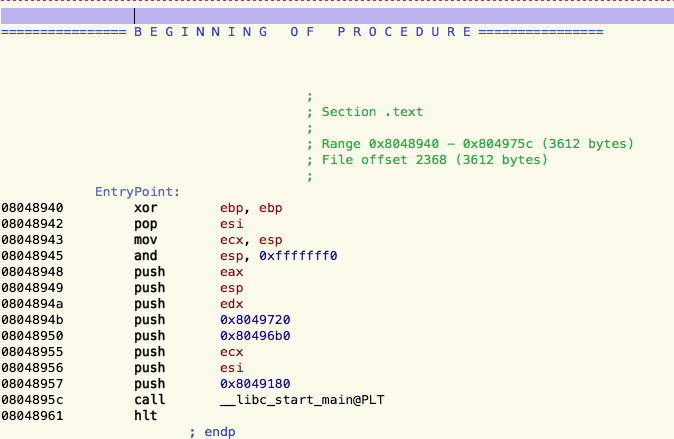
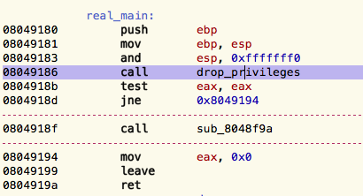
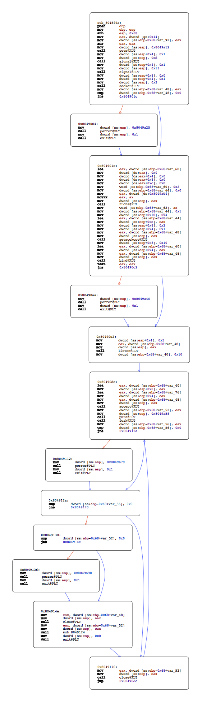
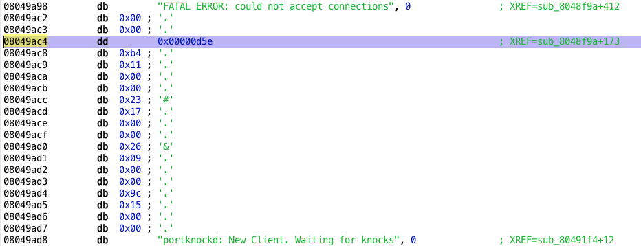
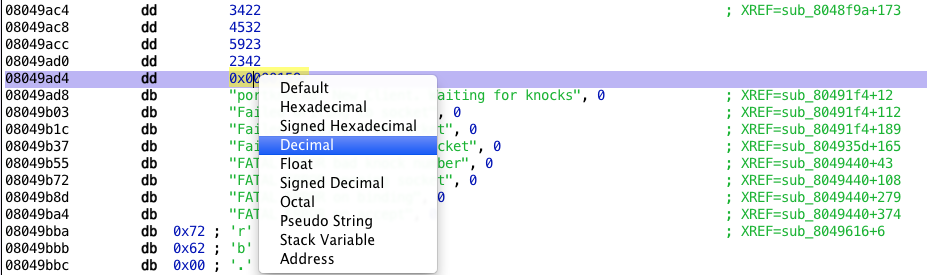

Static analysis of CySCA 2014 portknock using Hopper Disassembler

[CySCA](https://www.cyberchallenge.com.au/) is a Capure The Flag with challenges ranging from crypto to reverse engineering, and from forensic to web pentest. You can get all the challenges in a [VM](https://www.vulnhub.com/entry/cysca-cysca2014-in-a-box,94/), or just this [binary](resources/cysca_portknock/488f866ad090d0843657f322e516168a-re02).

We're going to analyze the second reverse engineering challenge, and try to capture the flag. As an added difficulty, we're going to restrict ourselves to static analysis. This means no logs, no debugger, only disassembly.

## First recon

Let's see what we can get without diving into disassembly.

    :::text
    $ file 488f866ad090d0843657f322e516168a-re02
    488f866ad090d0843657f322e516168a-re02: ELF 32-bit LSB executable, Intel 80386, version 1 (SYSV), dynamically linked (uses shared libs), for GNU/Linux 2.6.24, BuildID[sha1]=89593421780a0407b46f8d9c7671368699003cc9, stripped  

It's a simple linux x86 binary. Nothing fancy here, but the symbols are stripped.  

Let's look at the library functions used.

    :::text
    $ readelf -r 488f866ad090d0843657f322e516168a-re02

    Relocation section '.rel.dyn' at offset 0x5c8 contains 1 entries:
     Offset     Info    Type            Sym.Value  Sym. Name
    0804aff0  00001406 R_386_GLOB_DAT    00000000   __gmon_start__

    Relocation section '.rel.plt' at offset 0x5d0 contains 34 entries:
     Offset     Info    Type            Sym.Value  Sym. Name
    0804b000  00000107 R_386_JUMP_SLOT   00000000   setsockopt
    0804b004  00000207 R_386_JUMP_SLOT   00000000   read
    0804b008  00000307 R_386_JUMP_SLOT   00000000   printf
    0804b00c  00000407 R_386_JUMP_SLOT   00000000   fgets
    0804b010  00000507 R_386_JUMP_SLOT   00000000   fclose
    0804b014  00000607 R_386_JUMP_SLOT   00000000   inet_ntoa
    0804b018  00000707 R_386_JUMP_SLOT   00000000   signal
    0804b01c  00000807 R_386_JUMP_SLOT   00000000   chdir
    0804b020  00000907 R_386_JUMP_SLOT   00000000   alarm
    0804b024  00000a07 R_386_JUMP_SLOT   00000000   __stack_chk_fail
    0804b028  00000b07 R_386_JUMP_SLOT   00000000   getuid
    0804b02c  00000c07 R_386_JUMP_SLOT   00000000   htons
    0804b030  00000d07 R_386_JUMP_SLOT   00000000   perror
    0804b034  00000e07 R_386_JUMP_SLOT   00000000   accept
    0804b038  00000f07 R_386_JUMP_SLOT   00000000   waitpid
    0804b03c  00001007 R_386_JUMP_SLOT   00000000   fread
    0804b040  00001107 R_386_JUMP_SLOT   00000000   chroot
    0804b044  00001207 R_386_JUMP_SLOT   00000000   setgid
    0804b048  00001307 R_386_JUMP_SLOT   00000000   puts
    0804b04c  00001407 R_386_JUMP_SLOT   00000000   __gmon_start__
    0804b050  00001507 R_386_JUMP_SLOT   00000000   exit
    0804b054  00001607 R_386_JUMP_SLOT   00000000   __libc_start_main
    0804b058  00001707 R_386_JUMP_SLOT   00000000   write
    0804b05c  00001807 R_386_JUMP_SLOT   00000000   bind
    0804b060  00001907 R_386_JUMP_SLOT   00000000   getgid
    0804b064  00001a07 R_386_JUMP_SLOT   00000000   fopen
    0804b068  00001b07 R_386_JUMP_SLOT   00000000   __errno_location
    0804b06c  00001c07 R_386_JUMP_SLOT   00000000   fork
    0804b070  00001d07 R_386_JUMP_SLOT   00000000   listen
    0804b074  00001e07 R_386_JUMP_SLOT   00000000   setuid
    0804b078  00001f07 R_386_JUMP_SLOT   00000000   vsnprintf
    0804b07c  00002007 R_386_JUMP_SLOT   00000000   socket
    0804b080  00002107 R_386_JUMP_SLOT   00000000   close
    0804b084  00002207 R_386_JUMP_SLOT   00000000   send  

Interesting. We can bet on a network daemon that's self-contained. It's also certainly dropping its privileges, since it uses `setuid`, `setgid` and `chroot`.

We can confirm our assumptions by looking at the strings in the executable.

    :::text
    $ strings 488f866ad090d0843657f322e516168a-re02 | tail -f
    Failed writing to socket
    Failed reading from socket
    Failed writing flag to socket
    FATAL ERROR bad knock number
    FATAL ERROR opening socket
    FATAL ERROR on binding
    FATAL ERROR on accept
    /dev/urandom
    ERROR: Unable to open urandom
    ;*2$"  

Again, mostly network stuff. If we take a look at the rest of the output, we notice `/flags.txt`. The flag we're after should be on the filesystem.

## Disassembly

Now for the juicy parts. I'm using [Hopper Disassembler](http://www.hopperapp.com/) for easy cross-references, renaming, etc, but you can follow along in gdb, IDA, [radare](https://github.com/radare/radare2) or your custom mess of python scripts if you prefer.

After loading the executable in hopper, it's correctly identified as 32 bits ELF. The entry point looks like this:

It's a i386 executable, so the arguments are passed using the [cdecl][7] convention. This means that arguments are pushed on the stack in reverse order. The first argument of [`__libc_start_main`][8] is the address of `main`, thus `0x8049180`. In hopper, highlight it and press `N` to rename it to something more meaningful. Then jump to its disassembly by pressing enter.

Our `main` calls two functions, `sub_80489f4` and `sub_8048f9a`.

Taking a quick look at the library functions and the strings used in the first function, we can guess it's just dropping privileges. We don't need to understand its inner-working in the details.

After renaming the privilege-dropping function, `main` looks like this:  

Let's jump to the next function, `sub_8048f9a`. Since the control flow is more complex than `main`, hopper's graph-view comes in handy:  

This looks like an infinite loop, since the last block unconditionnaly `jmp` up. The error handling is pretty bare bone and is handled by several block calling `exit`.

The first block is setting up a `socket`, and the next blocks call `bind`, `listen` and `accept`. The daemon is thus listening for connections.

The port `bind`ed by the server is set with the following disassembly:

    :::assembly
	mov     eax, dword [0x8049ac4]        ; load port number from DATA segment into eax
	movzx   eax, ax                          ; truncate the higher bits (a port number is 16 bits)
	mov     dword [esp], eax              ; put eax on top of the stack, as first argument of the next call
	call    htons@PLT                        ; convert the port to network byte order (big endian)
	mov     word [ebp-0x68+var_62], ax    ; store it on the stack, at the offset represented by var_62
	mov     dword [ebp-0x68+var_44], 0x1
	mov     dword [esp+0x10], 0x4
	lea     eax, dword [ebp-0x68+var_44]
	mov     dword [esp+0xc], eax
	mov     dword [esp+0x8], 0x2
	mov     dword [esp+0x4], 0x1
	mov     eax, dword [ebp-0x68+var_48]
	mov     dword [esp], eax
	call    setsockopt@PLT
	mov     dword [esp+0x8], 0x10
	lea     eax, dword [ebp-0x68+var_60] ; address of the var_60 buffer (a struct sockaddr)
	mov     dword [esp+0x4], eax
	mov     eax, dword [ebp-0x68+var_48]
	mov     dword [esp], eax
	call    bind@PLT                        ; call bind with the sockaddr  

`bind` takes a `struct sockaddr *` that contains, among other things, the network port.

    :::c
    struct sockaddr_in {  
            short   sin_family;  
            u_short sin_port;  
            ...  
    };  

We can see that the `sockaddr` is built on the stack by copying values at different offsets. The `sockaddr` begins at `var_60`, and the port is stored at `var_62`, since a short is two bytes long.

The port value used by the disassembly is stored at `0x8049ac4`. In hopper, go to that address, and right-click the value to switch its representation to decimal. The port used is 3422.

We can confirm this assumption by netcating to the VM, and check if the port is open:

    :::text
    $ nc -v 192.168.0.104 3422
    Ncat: Version 6.45 ( http://nmap.org/ncat )
    Ncat: Connected to 192.168.0.104:3422.
    "^DNcat: 0 bytes sent, 4 bytes received in 0.61 seconds.  

Accepted connections get their own `fork`ed process, handled by the next undiscovered function, `sub_80491f4`. The parent process just stay in the `accept-then-fork` loop.

This function does the real work of the portknock, so we're going to analyze it in more details, using hopper's decompiler.

Unfortunately we need to help it a bit here. In the disassembly `call 0x80491c5`, the address isn't recognized as a procedure. If we get to the disassembly we can guess why:

    :::text
    080491c0         call       exit@PLT
    080491c5         push       ebp                         ;  <= The address called from the previous function
    080491c6         mov        ebp, esp
    080491c8         sub        esp, 0x18
    080491cb         mov        eax, dword [ebp-0x18+arg_offset_x0]
    080491ce         mov        dword [0x804b090], eax
    080491d3         mov        dword [esp+0x4], 0x804919c
    080491db         mov        dword [esp], 0xe
    080491e2         call       signal@PLT
    080491e7         mov        eax, dword [ebp-0x18+arg_offset_x4]
    080491ea         mov        dword [esp], eax
    080491ed         call       alarm@PLT
    080491f2         leave
    080491f3         ret  

The previous instruction is a call to `exit`. Since `exit` never returns, the compiler didn't generate a function epilogue (no `ret` instruction). Since Hopper doesn't know that the function has ended, it extends the procedure to the next epilogue, at `0x080491f3`.

To get the decompilation to work accurately, mark `0x080491c5` as a procedure. Doing so, the previous function doesn't see any epilogue anymore, so mark `sub_804919c` as a procedure again.

We can finally use the pseudo-code feature of Hopper on the portknock function and all its subfunctions:

    :::text
    function sub_80491f4 {
        var_36 = arg_offset_x0;
        eax = puts@PLT("portknockd: New Client. Waiting for knocks");
        var_32 = 0x0;
        while (var_32 <= 0x4) {
                sub_80491c5(var_36, 0xa);
                var_28 = sub_8049616(var_36, 0x98d2);
                var_40 = write@PLT(var_36, &var_28, 0x4);
                if (var_40 != 0x4) {
                        perror@PLT("Failed writing to socket");
                        close@PLT(var_36);
                        exit@PLT(0x1);
                }
                var_24 = 0x0;
                var_40 = read@PLT(var_36, &var_24, 0x4);
                if (var_40 != 0x4) {
                        perror@PLT("Failed reading from socket");
                        close@PLT(var_36);
                        exit@PLT(0x1);
                }
                var_44 = sub_80495e4(var_28, var_32);
                if (var_44 == var_24) {
                        if (var_32 == 0x4) {
                                sub_804935d(var_36);
                                close@PLT(var_36);
                                exit@PLT(0x1);
                        }
                        close@PLT(var_36);
                        eax = sub_8049440(var_32);
                        var_36 = eax;
                        var_32 = var_32 + 0x1;
                }
                else {
                        close@PLT(var_36);
                        eax = exit@PLT(0x1);
                }
        }
        return eax;
    }  

The only argument passed from the previous function is the connection's file descriptor, and is saved into `var_36`. After printing an informative message, the loop starts. The programmer certainly wrote a simple `for(int var_32 = 0; var_32 <= 4; var32++)`, but since some statements are re-ordered by the compiler, it's a bit harder to see.

Hint: `sub_80491c5(var_36, 0xa)` sets a time-out on the process handling the connection. You can safely ignore it for the purpose of the analysis.

`sub_8049616` generates a 4 bytes value (`var_28`) that is sent to the open connection using `write`. The response is `read` (into `var_24`). The next function called, `sub_80495e4`, uses the loop counter (`var_32`) and the value generated previously (`var_28`) to create a value that should match the value `read` from the network. If the values don't match, the process calls `exit`.

This is a simple challenge-response. We don't need to analyze the function creating the value, since that value is send to us. We only need to understand how that value and the loop counter are mixed together, replicate it and make the portknock succeed.

Here's the code for the mixing function, `sub_80495e4`:

    :::text
    function sub_80495e4 {
        if ((arg_offset_x4 & 0x1) == 0x0) {
            var_12 = (arg_offset_x4 + 0x2) * arg_offset_x0;
        }
        else {
            var_12 = 0x2 + arg_offset_x0 + arg_offset_x4;
        }
        eax = var_12;
        return eax;
    }  

Pretty simple. It takes the second argument (`arg_offset_x4`, the counter) and checks if its lower bit is set. Depending on the result, the mixing operation on the random value is different.

Let's rewrite it to python:

    :::python
    def mangler(rand, counter):  
    	if counter & 0x1 == 0x0:  
    		return (counter + 2) * rand  
    	else:  
    		return 2 + counter + rand  

If the response we send match the awaited response, the connection is `close`d and `sub_8049440` is called.

    :::text
    function sub_8049440 {
        var_92 = *0x14;
        signal@PLT(0xd, 0x1);
        if (arg_offset_x0 > 0x3) {
                perror@PLT("FATAL ERROR bad knock number");
                exit@PLT(0x1);
        }
        arg_offset_x0 = arg_offset_x0 + 0x1;
        var_52 = socket@PLT(0x2, 0x1, 0x0);
        if (var_52 < 0x0) {
                perror@PLT("FATAL ERROR opening socket");
                exit@PLT(0x1);
        }
        var_60 = 0x0;
        *(&var_60 + 0x4) = 0x0;
        *(&var_60 + 0x8) = 0x0;
        *(&var_60 + 0xc) = 0x0;
        var_60 = 0x2;
        var_64 = 0x0;
        var_62 = LOWORD(htons@PLT(LOWORD(*(arg_offset_x0 * 0x4 + 0x8049ac4)) & 0xffff));
        var_48 = 0x1;
        setsockopt@PLT(var_52, 0x1, 0x2, &var_48, 0x4);
        if (bind@PLT(var_52, &var_60, 0x10) < 0x0) {
                perror@PLT("FATAL ERROR on binding");
                exit@PLT(0x1);
        }
        listen@PLT(var_52, 0x5);
        var_44 = 0x10;
        var_56 = accept@PLT(var_52, &var_76, &var_44);
        close@PLT(var_52);
        if (var_56 < 0x0) {
                perror@PLT("FATAL ERROR on accept");
                exit@PLT(0x1);
        }
        eax = var_56;
        edx = var_92 ^ *0x14;
        if (CPU_FLAGS & E) {
                eax = __stack_chk_fail@PLT();
        }
        return eax;
    }  

This function looks complicated, but keep in mind we don't need to understand every detail. Seeing the functions called, we guess it's creating a socket and listening on a new port. All we have to do is guess which one. Resist the temptation of bruteforcing, we can do better! `htons` is used to convert a port number (or anything else) from host- to network byte order. This means that the data we need is its argument.

`*(arg_offset_x0 * 0x4 + 0x8049ac4)) & 0xffff)` is taking the port number from an offset of the address `0x8049ac4`. The `& 0xffff` is ignoring the higher bits of the data, since a port number is [ranging from 1 to 65535](https://en.wikipedia.org/wiki/Port_(computer_networking)#Technical_details). `arg_offset_x0` is the loop counter passed from the previous function, (`\+ 1`, see line `arg_offset_x0 = arg_offset_x0 + 0x1;`.

Since an `int` is 4 bytes long, the `htons` call looks like `port = htons(port_list[counter + 1])`, with `port_list` living at `0x8049ac4`.

By default, hopper shows `0x8049ac4` as one-byte data, in hex representation.  

We can display the data in a more port looking way. Select the first address containing only one byte, and press `D` three time to set the data size to 4 bytes. Repeat for the four next ports in list.

We can now toggle the representation to decimal instead of hex, and the port list is ours!  

## Wrapping up

* The first stage of the portknock is listening on port 3422
* It sends a 4 bytes value when we connect, and expects a specific response to go on.
* The next stage opens a new connections on a different port, and resend a challenge.
* When the challenge-response has been done 5 times, the portknock sends the flag.

Here's the code that performs this sequence:

	:::python
	import socket, struct, time

	def mangle(rand, counter):
		if counter & 0x1 == 0x0:
			return (counter + 2) * rand
		else:
			return 2 + counter + rand

	KNOCK_SERVER_IP = "192.168.0.105"
	ports = [3422, 4532, 5923, 2342, 5532]  # the list of knocked port, extracted from the binary

	for i, port in enumerate(ports):
		print("+ Knocking on", port)

		# create a TCP socket and connect to the portknock server
		s = socket.socket(socket.AF_INET, socket.SOCK_STREAM)
		s.connect((KNOCK_SERVER_IP, port))

		# receive and unpack the challenge
		buf =  s.recv(4096)
		received, =  struct.unpack('<i', buf)
		print("+ Received challenge value:", received) 

		send_me = mangle(received, i)

		print("+ Sending response", send_me)
		s.send(struct.pack('<i', send_me))

		# the VM is really slow to open a new socket, we need to wait a bit
		time.sleep(0.1)
	
	# we're in the last stage of the knock
	# receive and print the flag
	buf =  s.recv(4096)
	print("+ Got flag:")
	print(buf.decode())

The `'<i'` format means we’re packing or unpacking a little endian signed integer.

It's working!

	:::text
	$ python3 knock_it_up.py 
	+ Knocking on 3422
	+ Received challenge value # 0 : 92
	+ Sending response 184
	+ Knocking on 4532
	+ Received challenge value # 1 : 88
	+ Sending response 91
	+ Knocking on 5923
	+ Received challenge value # 2 : 65
	+ Sending response 260
	+ Knocking on 2342
	+ Received challenge value # 3 : 1
	+ Sending response 6
	+ Knocking on 5532
	+ Received challenge value # 4 : 109
	+ Sending response 654
	+ Got flag:
	DemonViolatePride346
