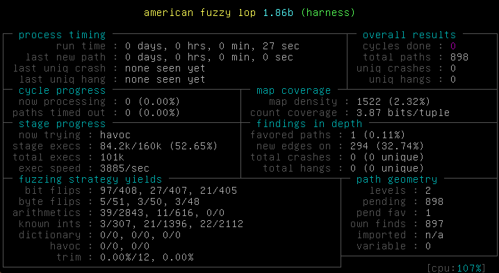

Fuzzing capstone using AFL persistent mode

Fuzzing is an automated testing technique that involves automatically sending input to a program and monitoring its output. It's a way to test for reliability as well as identify potential security bugs. Compared to manual auditing, fuzzing will only uncover real bugs that are actually reachable. 

Today we are fuzzing [capstone](http://www.capstone-engine.org). It's an open-source disassembly engine widely used in exploitation frameworks, disassemblers, debugging aids and other projects. You can take a look at a normal capstone usage [here](http://www.capstone-engine.org/lang_c.html).

The fuzzer we'll use is the hot new thing: [American Fuzzy Lop](https://lcamtuf.coredump.cx/afl/), AFL for short, a fuzzer that uses runtime guided techniques to create input for the tested program.

# Overview of the fuzzing process
AFL's usual operation mode goes like this:

* Start (fork) a new process
* Feed it some well chosen input
* Monitor the code and register which path are reached using this particular input

Internally, AFL checks if that input made the program reach new code path (either completely new blocks, or different sequence of blocks). If this is the case, the input is marked as 'interesting' and will be reused and remixed with other random or interesting inputs to try to reach deeper code path in the program, and yield more coverage.

To achieve runtime monitoring, AFL will inject code at compile time. This is done by substituting `gcc` or `clang` with AFL's wrappers: `afl-gcc` and `afl-clang`. The wrapper will call the normal compiler, then add the instrumentation code and produce a binary that can be monitored by `afl-fuzz`.

If you want to get a more thorough understanding of AFL's code coverage and how it generates new input, see [AFL's technical details](http://lcamtuf.coredump.cx/afl/technical_details.txt).

# Writing a test harness
Let's write a test harness for the library we test, capstone. We'll keep it simple: input from stdin, and test only a small part of the library.

	:::c
	#include <stdlib.h>
	#include <unistd.h>
	
	#include "capstone/include/capstone.h"
	
	int main(int argc, char** argv) {
		// The buffer we will pass to the library
		uint8_t buf[128];
		
		ssize_t read_bytes = read(stdin, buf, 128);
		
		csh handle;
		cs_insn *insn;
		
		size_t count;
		
		// cs_open and cs_disasm are the main functions needed to use capstone.
		// we feed them the data generated by AFL.
		// a normal program using capstone would then use the output of cs_disasm
		// to print a disassembly to the user for example
		if (cs_open(CS_ARCH_X86, CS_MODE_64, &handle) == CS_ERR_OK) {
			count = cs_disasm(handle, buf, read_bytes, 0x1000, 0, &insn);

			// don't forget to clean up after ourselves
			cs_free(insn, count);
		} else {
			return -1;
		}
		// close the capstone library
		cs_close(&handle);
	}

Let's run this with a random file as base. This is not ideal, but since the input is really small, the magic of the instrumentation should start to discover interesting values and branches pretty fast. 

To compile this you'll need to install [AFL](https://lcamtuf.coredump.cx/afl/) (including `llvm_mode`, needed for the next section), clang and llvm.

	:::text
	# compile an instrumented version of capstone
	git clone https://github.com/aquynh/capstone.git
	cd capstone
	CC=afl-clang-fast ./make.sh
	cd ..

	# compile and link our test harness using capstone's static library
	afl-clang-fast -static harness.c capstone/libcapstone.a -o harness
	
	# generate inputs
	mkdir inputs
	dd if=/dev/random of=inputs/rand bs=64 count=1
	afl-fuzz -i inputs -o findings ./harness

So far so good, AFL is running about 3.8k test/second, on just one core.

# Speeding things up: enter `AFL_PERSISTENT`.
AFL has various tricks to speed up the fork step, but forking a process every time we want to test an input is still pretty slow. What if we could skip it entirely, and reuse the same process multiple times?

We are going to use AFL's in-process fuzzing. This time, we don't restart a new process for each new input. This will be *much* faster depending on the library.

To do so, the test harness is nearly the same: we just need to add a loop.

Here's the code for that:

	:::c
	#include <stdlib.h>
	#include <unistd.h>
	#include <signal.h>
	#include <string.h>
	
	#include "capstone/include/capstone.h"
	#include <inttypes.h>
	
	
	int main(int argc, char** argv) {
	    csh handle;
	    cs_insn *insn;
	    size_t count;
	    uint8_t buf[128]; 
	    ssize_t read_bytes;
	
		while (__AFL_LOOP(1000)) {
			// (re-) initialize the library and read new input
			read_bytes = -1; 
			memset(buf, 0, 128);
			read_bytes = read(STDIN_FILENO, buf, 128);
	
			if (cs_open(CS_ARCH_X86, CS_MODE_64, &handle) == CS_ERR_OK) {
				// disassemble the bytes we just read using capstone
				count = cs_disasm(handle, buf, read_bytes, 0x1000, 0, &insn);
	
				// Don't leak memory. This is especially important in persistent mode, 
				// because we reuse the process a significant number of times
				cs_free(insn, count); 
			}
			cs_close(&handle);
		}
	    return 0;
	}

`__AFL_LOOP(1000)` is a macro that detects if the program is running under AFL. If it is, the loop will run 1000 times and 1000 different inputs will be fed to the library. After that, the process is torn down then restarted by AFL. This ensures we regularly replace the process to avoid memory leaks.

If the program runs on his own (i.e. launched with `./harness_persistent`) the loop only run once. This way we can test any input on our own without looping a thousand times. This mean we can use gdb or automated tools to inspect the crashes found by the fuzzer using the same binary.

Let's try it out!

	:::text
	afl-clang-fast -static harness_persistent.c capstone/libcapstone.a -o harness_persistent
	afl-fuzz -i inputs -o findings ./harness_persistent

Twice faster! Pretty good for a 3 lines diff. The VM I'm running this is dual core, so we can run one AFL instance per core:

	:::text
	afl-fuzz -i inputs -o multi_sync -M master ./fuzz_capstone
	# In another tmux
	afl-fuzz -i inputs -o multi_sync -S slave1 ./fuzz_capstone
	
	# and in another pane we can get the summary stats
	afl-whatsup -s multi_sync
	
	[...]
    Summary stats
    =============
    
           Fuzzers alive : 2
          Total run time : 0 days, 0 hours
             Total execs : 25 million
        Cumulative speed : 26432 execs/sec
           Pending paths : 1 faves, 4148 total
      Pending per fuzzer : 0 faves, 2074 total (on average)
           Crashes found : 0 locally unique

I let that run overnight and actually found [a harmless bug](https://github.com/aquynh/capstone/issues/463). More on that in the next part, along with analysis  of what we found, using AFL's tools (cmin, tmin, crash exploration mode), gdb and [crashwalk](https://github.com/bnagy/crashwalk).

# Rundown
In this article we  

* wrote a basic test harness for AFL, using stdio
* made a slightly more complicated harness that is persistent, and twice faster
* ran the fuzzer
